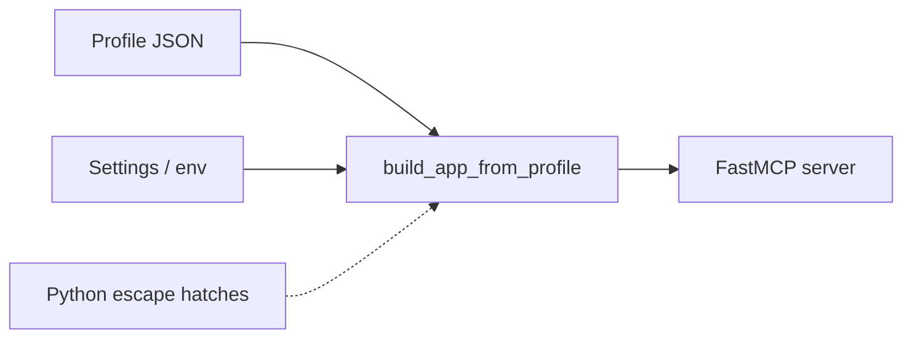

# Core concepts

This page is the mental model behind every bg-mcpcore server: the three inputs
that assemble one, the fixed pipeline that wires them, what happens on each
request, and the design rules that keep the core small while the fleet grows.

## :material-information-outline:  Why bg-mcpcore exists

BAUER GROUP runs a fleet of [Model Context Protocol](https://modelcontextprotocol.io)
servers that each front a REST API (Zammad, Shlink, and more). The first two
duplicated security-sensitive infrastructure — encrypted OAuth-state storage,
PII log redaction, rate limiting, the OAuth-gated bootstrap — as drifting copies.

bg-mcpcore gives that infrastructure **one audited, tested home** and turns a new
REST-API MCP server into a declarative profile plus a four-line entrypoint. The
guiding principle is one line:

!!! quote "Config for the standard, code for the complex"
    Everything most servers share is described **declaratively** in a JSON
    profile. The parts that genuinely differ between backends drop down to small
    Python **escape hatches** the profile points at — never a core edit.

## :material-vector-combine:  The three inputs

A server is assembled from two declared inputs plus optional Python:

| Input | Holds | Lives in | Changes per |
|---|---|---|---|
| **Profile** (JSON) | *structure*: backend shape, outbound-auth type, tool sources, route toggles, identity | a `.json` file in the repo | the server's design |
| **Settings** (env) | *runtime values + secrets*: inbound auth mode + credentials, public URL, rate-limit, Sentry, storage | environment variables | the deployment |
| **Escape hatches** (Python) | the genuinely-divergent logic: hand-written tools, custom resolvers/providers | the server's own modules | the backend's quirks |

The rule of thumb: **structure → profile, runtime/secret → env, complex behaviour
→ Python.** Secrets never live in the profile — they are referenced by env-var
name (`value_from_env`, `<key>_env`) and resolved at boot, failing closed if
unset. See [configuration](usage.md) for the full split and every setting.



`build_app_from_profile(profile, settings)` is the orchestrator. `make_cli`
wraps it in a Typer app, so a server's `main.py` is four lines:

```python
from bg_mcpcore import load_profile, make_cli

app = make_cli(load_profile("profiles/myserver.json"), version="1.0.0")
if __name__ == "__main__":
    app()
```

## :material-layers-triple:  The complexity tiers

How much Python a server needs falls into three tiers — pick the lowest that
fits your backend. The [tier guide](tiers.md) walks each with a full example.

| Tier | Backend shape | Python you write |
|---|---|---|
| **1 — pure config** | clean OpenAPI spec, standard inbound auth | none |
| **2 — config + a little Python** | OpenAPI spec + a few bespoke tools, or a custom outbound credential | ~10–30 lines |
| **3 — mostly Python** | no usable spec (hand-written tools), per-user on-behalf-of auth | the tool surface + a resolver |

Tiers are not exclusive: one profile can combine an OpenAPI surface with a few
hand-written tools and a per-user resolver. You start at the lowest tier and add
code only where the backend forces it.

## :material-pipe:  The assembler spine

`build_app_from_profile` runs a **fixed pipeline** with hook seams for the parts
that genuinely differ. The order is deliberate:

```text
setup_logging            # so everything after logs in one structured shape
  → init_sentry          # error tracking, only if a DSN is set
  → build inbound auth    # the AUTH_MODE provider (closed set, fail-closed)
  → build outbound client # UpstreamClient + the outbound resolver (if backend)
  → construct OR build    # an openapi source builds the FastMCP; else a bare one
  → rate-limit middleware # added FIRST — the cheapest rejection path
  → auth-mode middleware  # e.g. the Entra tenant allowlist
  → register tool sources # python (full ctx) + registry (settings-less ctx)
  → load extensions       # declarative prompts + resources
  → healthz / logo / index routes
  → startup banner + loud auth warnings
```

Two forks live on this spine:

- **Construct vs. register** ([tool sources](tools.md)). A *constructing* source
  (`openapi`) builds the FastMCP instance from a spec; *registering* sources
  (`python`, `registry`) add onto it. At most one constructing source.
- **Inbound auth is a closed set** ([authentication](authentication.md)). An
  unknown `AUTH_MODE` raises rather than silently booting unauthenticated.

## :material-sync:  The request lifecycle

What the framework does on each inbound MCP call:

```text
inbound request
  → rate-limit middleware       # keyed on OAuth subject or client IP; cheapest rejection
  → auth-mode middleware        # e.g. Entra tenant allowlist          [if configured]
  → inbound auth validation     # FastMCP OAuth provider verifies the caller's token
  → tool dispatch
      → ToolContext.request(...) → UpstreamClient
          → outbound resolver: static default header + per-call auth_headers(ctx)
          → retry/backoff on transient upstream errors (idempotency-aware)
  → response
```

The inbound token is **never** forwarded upstream automatically. The only way a
caller's identity reaches the backend is an explicit on-behalf-of outbound
resolver that resolves it per call (and fails closed when it can't) — see
[authentication](authentication.md).

## :material-shield-account:  Least privilege: the ToolContext

Tool sources receive a `ToolContext`, but not all the same one. The server's own
trusted code (the `python` escape hatch) gets the **full** context, including
`settings` with its `SecretStr` fields. OpenAPI, registry, and third-party
sources get a **settings-less** context — an authenticated `client` and a logger,
but `settings = None`. This boundary is enforced by the assembler, not merely
documented. See the [security model](security.md).

## :material-power-plug:  Modularity: new capability = config or a plugin, never a core edit

The core stays small and stable; everything extensible hangs off versioned
seams — Python **entry points**, the same mechanism pytest uses:

| Entry-point group | Adds | Built-ins |
|---|---|---|
| `bg_mcpcore.tool_sources` | a `tools.source` value | `python`, `registry`, `openapi` |
| `bg_mcpcore.auth_providers` | an inbound `AUTH_MODE` | `none`, `oidc` + 15 first-class providers |
| `bg_mcpcore.auth_middleware` | a post-auth gate | the Entra tenant allowlist |
| `bg_mcpcore.auth_resolvers` | an outbound `auth.type` | hardcoded built-ins + third-party |
| `bg_mcpcore.tools` | a named registry tool | `bg.ping`, `bg.health` |

A new IdP, tool protocol, or credential scheme is a **pip-installable plugin** —
it never requires changing `bg-mcpcore`. See [writing plugins](plugins.md).

## :material-link-lock:  Stability & the FastMCP coupling

The mandatory core binds to a few private FastMCP symbols (e.g. the storage
key-derivation `derive_jwt_key`). A security regression test guards that
invariant so a FastMCP bump that changes it fails loudly rather than silently
invalidating every deployed OAuth session. Volatile concerns (OpenAPI tooling,
Azure, Redis, docket) are isolated in optional extras, so a churn there cannot
destabilise core.

## :material-arrow-right-circle:  Where to go next

- [Installation](installation.md) · [Quickstart](quickstart.md)
- [The three tiers](tiers.md) — config vs. code, with a full example per tier
- [Configuration & settings](usage.md) — every env var and the profile/settings split
- [Authentication](authentication.md) · [Tool sources](tools.md) · [Extensions](extensions.md)
- [Security model](security.md) — the fail-closed invariants in full
